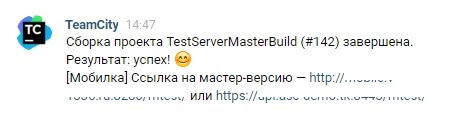

# vk-teamcity-bot

Бот, который по вебхукам от Teamcity отправляет сообщения ВК в беседу или пользователю. Запускается по файлу `./start.bat` или с помощью команды `npm start` из терминала.

Примеры:

Конфигурация бота располагается в файлах `./src/app-config.json` и `./app-chats-settings.json`.

Описания полей `app-config.json`:

-   `port` - порт, на котором будет запускаться бот
-   `bot` - настройки для бота
-   -   `group_id` - ID сообщества, которое является родительским для бота
-   -   `token` - API-токен бота
-   -   `secret` - secret-токен бота из настроек сообщества
-   -   `confirmCode` - код подтверждения при первом запуске

Описания полей `app-chats-settings.json`:

-   `peer_id` (num) - уникальный ID беседы или пользователя
-   `subscriptions` - хэш-таблица с айдишниками проектов TeamCity, можно взять из URL (например http://localhost:8181/viewType.html?buildTypeId=LongTestProjectId_Test123_Test - `LongTestProjectId_Test123_Test`)
-   `alwaysShowResultLink` (bool) - показывать ссылку на информацию о билде или нет. Если false, ссылка будет показываться только в случае неудачного билда
-   `extraLinks` - массив с дополнительными ссылками (будут отображены как кнопки)
-   -   `trigger` - один из элементов массива `subscriptions`
-   -   `links` - массив со ссылками
-   -   -   `url` - ссылка
-   -   -   `text` - текст

Учитывате, что одно сообщение может вмещать только две кнопки со ссылками!
